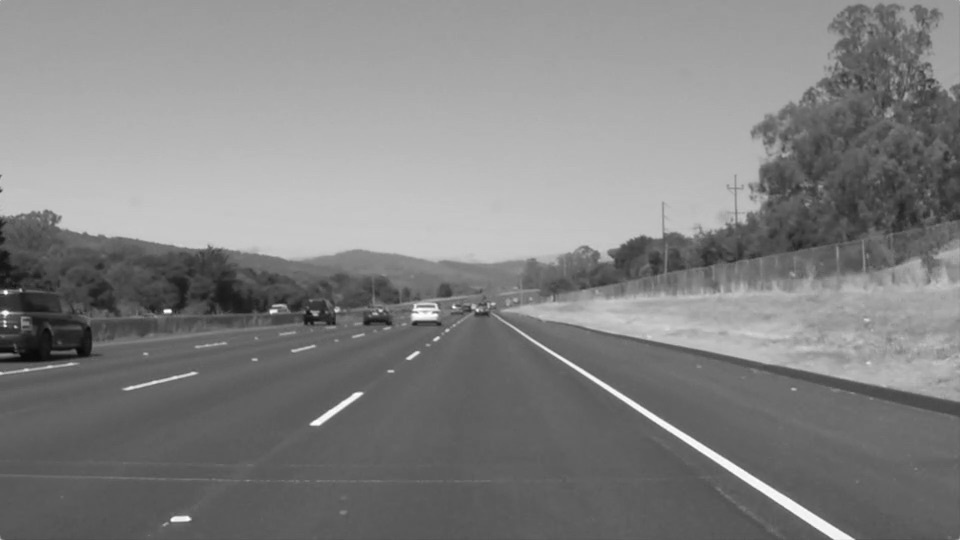
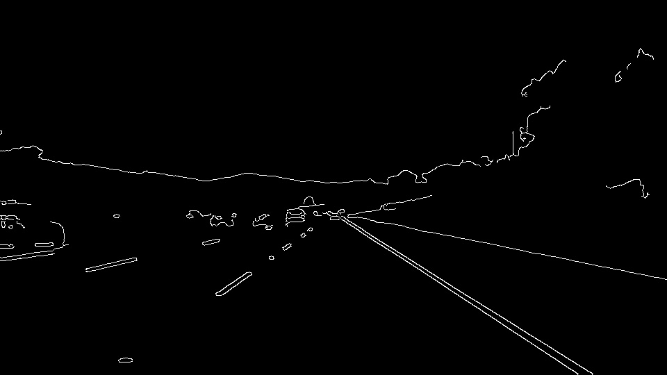
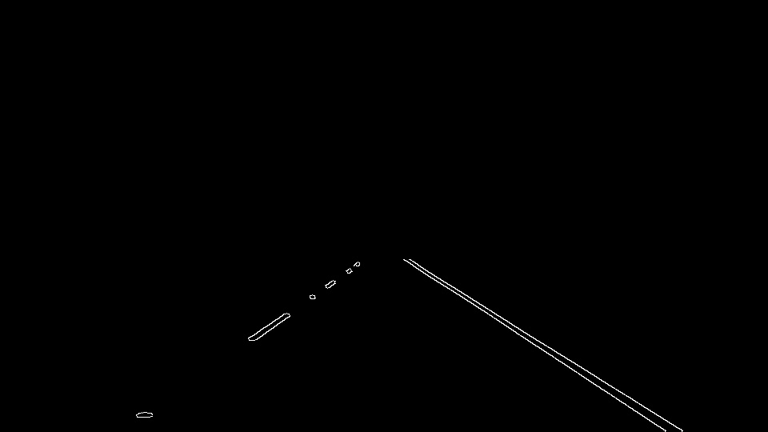
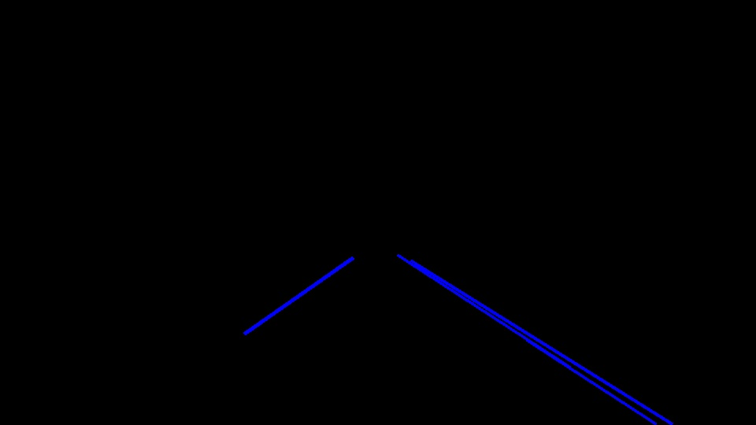
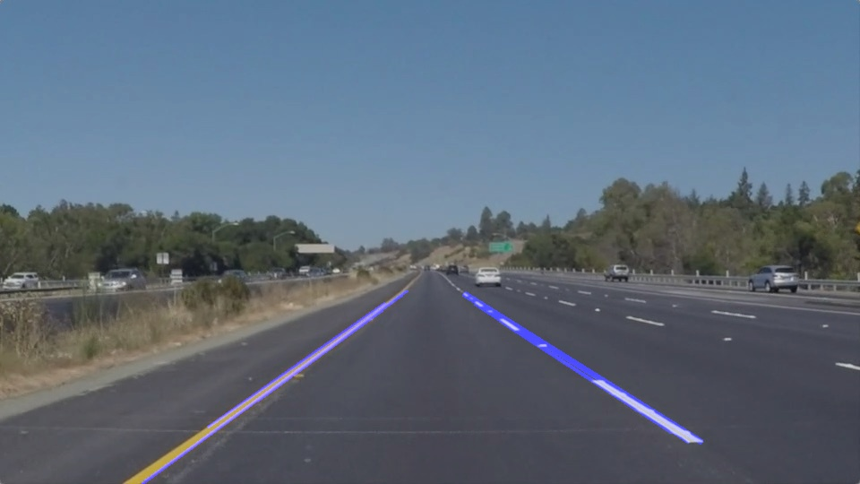

# **Finding Lane Lines on the Road** 


The goal of this little write up is to explain how I approached the problem of finding lane lines on a road, based on three given video files.
I have constructed a simple pipeline that, for the given videos, rather accurately locates the road lines and paints them on the video frames.

[default_image]: writeup/solidWhiteRight.jpg
[default_image2]: ./test_images/solidYellowLeft.jpg
[gray_image]: writeup/solidWhiteRight_gray.jpg
[edges_image]: writeup/solidWhiteRight_edges.jpg
[roi_image]: writeup/solidWhiteRight_roi.jpg
[hough_image]: writeup/solidWhiteRight_lines.jpg
[line_segments]: writeup/line_segments.png
[combined]: ./test_images_output/solidYellowLeft.jpg

---

### Reflection

#### The base pipeline

My pipeline is fairly similar to what was presented to us during the lectures. 

To make it very clear, I will walk you through an example image to better portray what happens during each step of the pipeline. 
The image I will use is the following: \


I start off with converting the incoming image to grayscale, since apart from the color white, we do not really need much color information and it makes the computations faster.
We now obtain the following output:\


Next up, we would like to extract the edges from the image frame. This will work, however from experimenting with the data, I found that using a Guassian Blur before extracting the edges works better. 
So, we simply apply a Guassian Blur with a kernel size of 5 to the image, after which we run the Canny algorithm on the frame to obtain the edges. 
For the thresholds I use 50 and 150 for low and high respectively.
These two steps obtain the following image:\


This already looks very good. We can clearly see the lane lines being detected. However, there is also a lot of noise in the background.
Perhaps it is a good idea to now find the region of interest. For the exact procedure of how I did this, I refer to the included code.
After finding the ROI, we obtain the following image:\
\
Looking good! We managed to filter out most of the background noise.

Finally, we are now ready to detect actual lines. We can simply use the Hough Transform for this. Specifically, the probabilistic version. 
After a lot of parameter tweaking, I found that the following parameters worked best:
- Rho = 1
- Theta = PI / 180
- Threshold = 20
- Min line length = 130
- Max line gap = 100

Applying the algorithm with these parameter settings, the following image is produced:\
\
This means that we are able to detect the lane lines with a pretty good accuracy.
The issues is still that on the left side, only part of the lane line is detected.
Hopefully, we can use the slope information to extrapolate the lane lines later.

#### The extrapolation of the lane lines

As hinted before, we can probably use the slope information to extrapolate the lane lines. 
A positive slope on a line means that it is most likely part of the left lane line, whereas if the slope is negative it is probably part of the right lane line.
Using this information, we can separate the left and right lane line segments.

The way I solved this specifically is rather technical (if you are curious, have a look at the code), 
however the main idea is as follows. The Hough transform function returns a list of tuples in the form of (x1, y1, x2, y2).
From this, a slope can be calculated and based on this slope we can separate the line segments into belonging to the left or right lane.
Furthermore, if one separates the Hough transform line segments into individual x- and y-coordinates, we can plot them as follows:

Original image             |  Line segment coordinates
:-------------------------:|:-------------------------:
![Default Image][default_image2]  |  ![Default Image][line_segments]

where the blue dots represent line segment coordinates for the left lane line and orange represent line segment coordinates for the right lane line.
The nice thing about this representation of the data, is that we can perform regression on the points for each lane line and extrapolate.

Simple linear regression is influenced by outliers quite a bit, and so I chose to use a Huber Regression model from the Python package sklearn.
This turned out not to work very well, due to some unforeseen C++ errors, so I opted for the TheilSenRegressor instead.
This regressor fits the model according to the median deviation, rather than the mean and is therefore much less prone to outliers.

Additionally, to make the predicted line even more stable I only looked at lines that had a 'sensible' slope. 
Specifically, I only accepted line segments with a slope such that: 0.5 <= |slope| <= 0.8, where |x| denotes the absolute value of x.

Finally, to make the line less jumpy between frames I also kept a 'running median' (of size 60) of both the slope and intercept of both predicted lines.

Putting it all together, we get the following predicted lines:\


### 2. Shortcomings of the pipeline
- The biggest shortcoming of the current pipeline is that the parameters are heavily tailored to the videos (and images) that are given to me.
An example of this is the region of interest, which is highly dependent on where the camera is located.
I have tried it on different videos and images, but very often the Hough transform would simply not be able to find lines and so will crash.

- Furthermore, I heavily restrict the amount of lines since I only allow certain slopes from a small range of possible slopes. 
This results in the pipeline not being able to handle sharp turns, nor can it handle completely valid scenarios such as round abouts.

- Due to the running 'median' that is used *even if no lines could be found for a specific frame*, it could happen that a car will just keep on driving straight without this being a good idea.
This might give a false sense of 'confidence'.

- For the challenge video, it is also rather apparent that a straight line fit might not be the best idea. Since this does not account for curvature in the road.

- A final paint point that I can think of is that my current pipeline is not computationally cheap at all. 
The regressor model is far from fast, and so I doubt this can be used in real time.

There are definitely another myriad of issues that I can currently not come up with.

### 3. Possible improvements to the pipeline

- The pipeline would be much better if somehow we can use some sort of segmentation algorithm (such as a neural network) to dynamically find the region of interest for us.
This eliminates a set of hyper parameters, which is a good thing.

- The current line/edge detection algorithm is very unstable and so if there are a lot of cars some of them will most likely be detected as line segments.

- Allow the predicted lines to by higher order polynomials to more accurately model the curvature of the road.

### Further output

You can find the output of my pipeline in both the ```test_images_output``` and ```test_videos_output``` folder.
Currently my pipeline is able to handle all the file rather well (partly due to parameter overfit).
The results for the challenge file are a little unstable, but fairly 'sensible' throughout.
